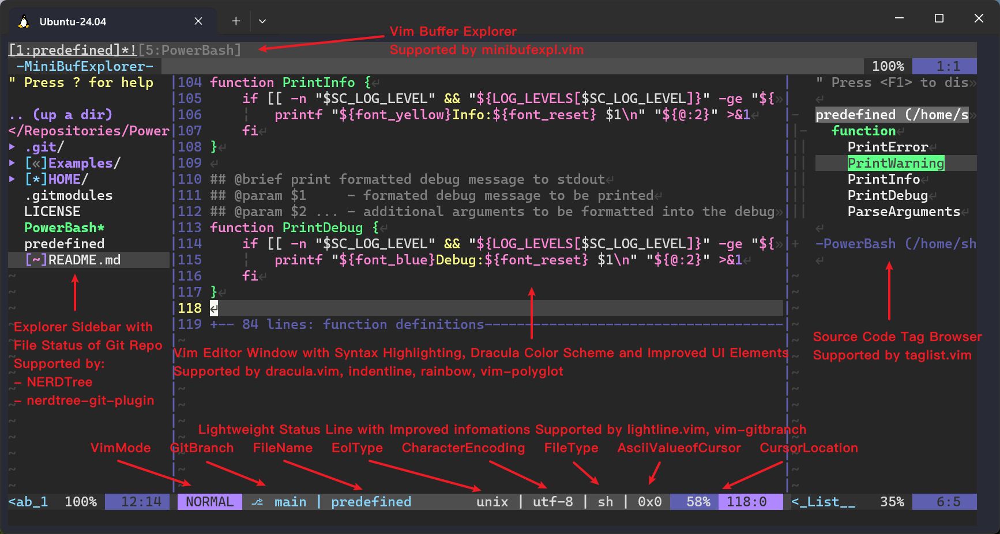

# PowerBash

PowerBash is a comprehensive, user-scoped environment configuration suite that supercharges your
command-line productivity. It provides a highly customized Bash shell, advanced Git integration,
a powerful tmux setup, and a feature-rich Vim environment with pre-configured plugins, all designed
for convenience, clarity, and efficiency.


## Features

### 🖥️ Enhanced Bash Environment

- **Custom PS1 Prompt:**  
  - Shows command return code status (`x` for failure, `o` for success).
  - Displays the current Git branch (with `⎇` symbol) if inside a Git repository.
  - Presents a complete and informative present working directory (PWD) path.
  - Distinguishes root (`#`) and normal user (`$`) prompts.
- **Clipboard Integration:**  
  - Includes the `osc_yank` function for copying text to the system clipboard via OSC52 escape
    sequences, supporting xterm, tmux, and screen.
- **Improved History and Usability:**  
  - Appends to history, ignores duplicates, and sets sensible history sizes.
  - Enables useful shell options: `globstar`, `checkwinsize`, `autoindent`, and more.
- **Colorful and Informative:**  
  - Color support for prompt, `ls`, `grep`, and GCC output.
  - Handy aliases for `ls`, `grep`, and more.
  - Syntax highlighting for `man` pages, supported by `bat`.
- **Automatic Sourcing:**  
  - Loads additional aliases from `~/.bash_aliases` if present.
  - Enables programmable completion if available.

### 🛠️ User-Scoped Git Configuration

- **Custom `.gitconfig`:**  
  - Useful aliases for submodule management (commands like `git sclone`, `git supdate`, etc.).
  - Pretty log formatting (commands like `git lg`).
  - Sets Vim as the default editor and uses a custom commit message template.
  - Enables colored output and credential storage.
- **`.gitignore`:**  
  - Ignores build artifacts, tags, cscope files, and visual studio code editor folders.
- **Commit Message Template:**  
  - Enforces a consistent, emoji-based commit message style with clear scopes and change types.

### 🖥️ Custom tmux Configuration

- **User-level `.tmux.conf`:**  
  - Enables mouse support, sets a modern status line, and configures useful key bindings.
  - Ensures compatibility with various tmux versions.
  - Sets up history limits, color schemes, and other usability tweaks.

### 📝 Advanced Vim Environment

- **Custom `.vimrc`:**  
  - Enables syntax highlighting, color schemes (Dracula), and improved UI elements.
  - Sets up filetype detection, indentation, and encoding options.
  - Defines convenient key mappings for window navigation, quickfix, and more.
  - Integrates cscope support for code navigation.
  - Adds OSC52 yank support for copying text from remote to the local system clipboard.
- **Pre-configured Plugins (via Pathogen):**
  - **a.vim** Swtich between source files and header files quickly.
  - **ack.vim:** Fast code pattern searching (configured to use `ag` if available).
  - **auto-pairs:** Automatic insertion of matching brackets and quotes.
  - **dracula.vim:** Dracula color scheme.
  - **indentline:** Visual indentation guides.
  - **leaderf:** Fuzzy file and tag finder.
  - **lightline.vim:** Lightweight, customizable statusline.
  - **minibufexpl.vim:** Buffer explorer.
  - **NERDTree:** File explorer sidebar.
  - **nerdtree-git-plugin:** Git status integration for NERDTree.
  - **OmniCppComplete:** C++ code completion.
  - **rainbow:** Rainbow parentheses for better code readability.
  - **taglist.vim:** Source code tag browser.
  - **vim-auto-popmenu:** Improved completion popup.
  - **vim-commentary:** Easy commenting.
  - **vim-cppman:** C++ manual integration.
  - **vim-dict:** Dictionary support for Vim.
  - **vim-gitbranch:** Git branch info for statuslines.
  - **vim-gitgutter:** Git diff indicators in the sign column.
  - **vim-plugin-AnsiEsc:** ANSI escape sequence highlighting.
  - **vim-polyglot:** Language pack for Vim.
  - **xterm-color-table.vim:** Color table utility.


## Installation

1. **Clone the repository with submodules:**
    ```bash
    git clone --recurse-submodules https://github.com/sheer-rey/PowerBash.git
    ```

2. **Install the configuration files by running the installer script:**
    ```bash
    cd PowerBash
    ./PowerBash -i
    ```
    By default, this installs to your `$HOME` directory. See `./PowerBash -h` for more information.

3. **Start the new bash environment or re-source your .bashrc to make configuration changes take effect in your shell:**
    ```bash
    source ~/.bashrc
    ```

4. **Start a new tmux session to enjoy tmux with the enhanced configuration:**
    ```bash
    tmux
    ```

5. **Open Vim to enjoy the enhanced environment:**
    ```bash
    vim
    ```


## Uninstallation

To uninstall PowerBash and revert to your previous configurations, run the uninstaller script:
```bash
cd PowerBash
./PowerBash -u
```
This will remove the installed configuration files from your `$HOME` directory.


## Examples && Usage

### Bash

- Enjoy a prompt that shows command status, Git branch, and full PWD.  
  
- Use `osc_yank` to copy text to your clipboard from the terminal.
- Use handy aliases like `ll`, `la`, and `alert`.  

### Git

- Use aliases like `git lg`, `git sclone`, `git supdate`, `git sfetch`, `git spull`, `git spush`, etc.  
  

- Commit messages will use the provided template for clarity and consistency.  
  

### tmux

- Use mouse support, modern status line, and improved navigation out of the box.  
  

- Commonly used tmux shortcuts

  | Keys | Action | Notes |
  |------|--------|-------|
  | `Prefix c` | Create new window | Opens a new tmux window |
  | `Prefix &` | Kill current window | Prompts for confirmation |
  | `Prefix n` | Next window | Cycle to the next window |
  | `Prefix p` | Previous window | Cycle to the previous window |
  | `Prefix <Num>` | Choose window | |
  | `Prefix ,` | Rename window | Prompts for a new window name |
  | `Prefix .` | Move window | Prompt for destination index |
  | `Prefix %` | Split pane vertically | Creates a vertical split |
  | `Prefix "` | Split pane horizontally | Creates a horizontal split |
  | `Prefix o` | Select next pane | Cycle focus to the next pane |
  | `Prefix ;` | Select previous pane | Cycle focus to the previous pane |
  | `Prefix z` | Toggle pane zoom | Zooms the current pane |
  | `Prefix x` | Kill current pane | Closes the active pane |
  | `Prefix {` | Swap pane left/up | Swap current pane with previous |
  | `Prefix }` | Swap pane right/down | Swap current pane with next |
  | `Prefix [` | Enter copy mode | Navigate and copy text in history |
  | `Prefix ]` | Paste buffer | Paste the tmux buffer into pane |
  | `Prefix r` | Reload config | Reload `~/.tmux.conf` without restarting |
  | `Prefix d` | Detach session | Detach from the current tmux session |
  | `Prefix s` | Choose session | Interactive session switcher |
  | `Prefix ?` | Show key bindings | Displays configured tmux shortcuts |

> Notes:  
  Default Prefix is `Ctrl+B`, configured Prefix is `Alt+E`.  
  If a mapping conflicts with your terminal, ensure your terminal emulator sends Alt/Meta keys or remap the prefix.  

### Vim

- Use `<Leader>n` to toggle NERDTree, `<Leader>y` to yank to clipboard, `<Leader>m` to toggle taglist, and more.
- Enjoy enhanced code navigation, completion, and syntax highlighting.
- All plugins are managed via Pathogen and are ready to use.  
  

- Commonly used vim commands and key mappings (Configured <Leader> is `;` in this setup)
  | Command | Description | Provided by |
  |---------|-------------|-------------|
  | `:w<CR>` | Save current file | Built-in |
  | `:q<CR>` | Quit current window | Built-in |
  | `:e {file}<CR>` | Open/edit a file | Built-in |
  | `:split<CR>` | Split window horizontally | Built-in |
  | `:vsplit<CR>` | Split window vertically | Built-in |
  | `:ls<CR>` | List opened buffers | Built-in |
  | `:bnext<CR>` | Jump to next buffer | Built-in |
  | `:bprev<CR>` | Jump to previous buffer | Built-in |
  | `:CscopeReload<CR>` | Try to find cscope database in `pwd` and reload it | Project-configured |
  | `:Helptags<CR>` | Generate vim help documents for installed plugins | pathogen.vim |
  | `:Ack {pattern}<CR>` | Fast project search (uses `ag` if available) | ack.vim |
  | `:LeaderfFiles<CR>` | Open fuzzy file finder | ctrlp / leaderf |
  | `:LeaderfBuffer<CR>` | Open fuzzy buffer finder | ctrlp / leaderf |
  | `:LeaderfFunction<CR>` | Open fuzzy function finder for current buffer | leaderf |
  | `:LeaderfFunctionAll<CR>` | Open fuzzy function finder for all loaded buffers | leaderf |
  | `:Cppman! {symbol}<CR>` | Open C manual for symbol | vim-cppman |
  | `:Cppman {symbol}<CR>` | Open C++ manual for symbol | vim-cppman |

  ---

  | Key Mapping | Description | Provided by |
  |-------------|-------------|-------------|
  | `<C-W> h` | Jump to the window left | Built-in |
  | `<C-W> j` | Jump to the window below | Built-in |
  | `<C-W> k` | Jump to the window above | Built-in |
  | `<C-W> l` | Jump to the window right | Built-in |
  | `<C-P>` | Open fuzzy file finder | ctrlp / leaderf |
  | `<C-X><C-O>` | Trigger omni-completion (C/C++ via OmniCppComplete) | OmniCppComplete |

  ---

  | Key Mapping without prefix | Description | Provided by |
  |----------------------------|-------------|-------------|
  | `gc` | Toggle comment on selected lines | vim-commentary |
  | `gcc` | Toggle comment on current line | vim-commentary |
  | `]c` | Jump to next git change | vim-gitgutter |
  | `[c` | Jump to previous git change | vim-gitgutter |
  | `K` | Open C/C++ manual page for symbol under the cursor | vim-cppman |

  ---

  | Key Mapping with <Leader> key | Description | Provided by |
  |-------------------------------|-------------|-------------|
  | `<Leader>h` | Jump to the window left | Project-configured |
  | `<Leader>j` | Jump to the window below | Project-configured |
  | `<Leader>k` | Jump to the window above | Project-configured |
  | `<Leader>l` | Jump to the window right | Project-configured |
  | `<Leader>s` | Split window horizontally and explore current file's directory | Project-configured |
  | `<Leader>v` | Split window vertically and explore current file's directory | Project-configured |
  | `<Leader>y` | Yank selection to local clipboard via OSC52 | Project-configured |
  | `<Leader>co` | Open quickfix window | Project-configured |
  | `<Leader>cc` | Close quickfix window | Project-configured |
  | `<Leader>cn` | Jump to next result of quickfix window | Project-configured |
  | `<Leader>cp` | Jump to previous result of quickfix window | Project-configured |
  | `<Leader>cl` | Show result list in quickfix window | Project-configured |
  | `<Leader>a` | Switch between source/header file (C/C++) | a.vim |
  | `<Leader>n` | Toggle file explorer sidebar | NERDTree |
  | `<Leader>m` | Toggle source tag browser | taglist.vim |
  | `<Leader>ff` | Open fuzzy file finder | ctrlp / leaderf |
  | `<Leader>fb` | Open fuzzy buffer finder | ctrlp / leaderf |
  | `<Leader>fm` | Open fuzzy function finder for current buffer | leaderf |
  | `<Leader>fam` | Open fuzzy function finder for all loaded buffers | leaderf |
  | `<Leader>fr` | Launch leaderf to use rg interactively | leaderf |

> Notes:  
  Built-in commands work in any Vim. Plugin-provided commands may require the plugin to be installed and loaded (they are included in this project).  
  To find exact commands for a plugin, open its docs under ~/.vim/bundle/{plugin}/doc or use `:Helptags` after installing bundles.  
  If Python support is not available in Vim or Vim version is below 7.4.1126, Leaderf plugin is inactive and CtrlP plugin is fallback to active, otherwise CtrlP plugin is disabled.  
  Check Python support with `:echo has('python')` or `:echo has('python3')` in Vim command mode.  
  Check Vim version with `:version` in Vim command mode.

## Requirements

In order to make PowerBash works properly, ensure you have the following tools installed:
- `git`
- `tmux` (almost versions is compatible, but 3.4 and above recommended)
- `vim` (almost versions is compatible, but 8.1 and above recommended)
- `python2/3` (for various Vim plugins)

And to make full use of all features, it's recommended to also have the following tools:
- `bat` (for syntax highlighting in `man` pages)
- `ack` or `ag` (for fast searching in Vim)
- `ctags` (for taglist and code navigation in Vim)
- `cscope` (for code navigation in Vim)
- `gtags` (for GNU Global tagging system support in Vim)
- `gtags-cscope` (for cscope database generation and code navigation in Vim)
- `rg` (ripgrep, for fuzzy finding in Vim)
- `cppman` (for C++ manual integration in Vim)

With Ubuntu22.04 or later, you can install these tools using:
```bash
sudo apt install -y git tmux vim python3 bat ack silversearcher-ag universal-ctags cscope global ripgrep cppman
```


## Customization

- You can further customize any configuration file in your `HOME/` directory.
- You can further add your own aliases to `~/.bash_aliases`.
- You can further extend Vim with more plugins by adding them to `HOME/.vim/bundle/`.


## Thanks
This project is inspired by and adapted or reused from the following excellent resources:

- [PowerVim](https://github.com/youngyangyang04/PowerVim)
- [OmniCppComplete](https://github.com/vim-scripts/OmniCppComplete)
- [a.vim](https://github.com/vim-scripts/a.vim)
- [ack.vim](https://github.com/mileszs/ack.vim)
- [auto-pairs](https://github.com/jiangmiao/auto-pairs)
- [ctrlp.vim](https://github.com/ctrlpvim/ctrlp.vim)
- [dracula.vim](https://github.com/dracula/vim)
- [indentLine](https://github.com/Yggdroot/indentLine)
- [leaderF](https://github.com/Yggdroot/LeaderF)
- [lightline.vim](https://github.com/itchyny/lightline.vim)
- [minibufexpl.vim](https://github.com/fholgado/minibufexpl.vim)
- [nerdtree](https://github.com/preservim/nerdtree)
- [nerdtree-git-plugin](https://github.com/Xuyuanp/nerdtree-git-plugin)
- [rainbow](https://github.com/luochen1990/rainbow)
- [taglist.vim](https://github.com/vim-scripts/taglist.vim)
- [vim-auto-popmenu](https://github.com/skywind3000/vim-auto-popmenu)
- [vim-commentary](https://github.com/tpope/vim-commentary)
- [vim-cppman](https://github.com/skywind3000/vim-cppman)
- [vim-dict](https://github.com/skywind3000/vim-dict)
- [vim-gitbranch](https://github.com/itchyny/vim-gitbranch)
- [vim-gitgutter](https://github.com/airblade/vim-gitgutter)
- [vim-gutentags](https://github.com/ludovicchabant/vim-gutentags)
- [vim-plugin-AnsiEsc](https://github.com/powerman/vim-plugin-AnsiEsc.git)
- [vim-polyglot](https://github.com/sheerun/vim-polyglot)
- [xterm-color-table.vim](https://github.com/guns/xterm-color-table.vim)

Thanks to their authors for their contributions to the open-source community!


## License

This project is licensed under the GPL-3.0 License.

---

*Make your Bash, Git, tmux, and Vim environments more powerful and convenient with PowerBash!*
